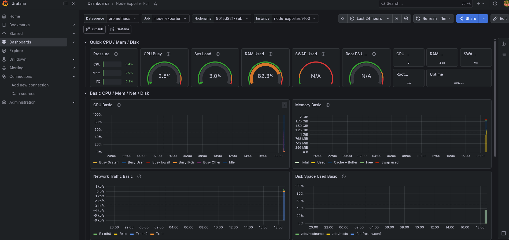

# 🚀 Phase 4 – Containerized Workload, Monitoring & Automated Database Recovery

---

## 📌 Purpose

Deploy a fully containerized workload and monitoring stack on the provisioned EC2 instance, including:

* SQL Server (Developer Edition)
* Prometheus (metrics collection)
* Grafana (visualization)
* node_exporter (host metrics)

Additionally, this phase introduces **automated database recovery**, demonstrating repeatable database provisioning using Ansible.

This phase transitions the environment from infrastructure into a **live, observable, and reproducible system**.

---

## 🧱 Architecture

```text
AWS EC2 (Ubuntu)
└── Docker / Docker Compose
    ├── SQL Server (Developer Edition)
    ├── Prometheus
    ├── Grafana
    └── node_exporter
```

---

## 📁 File Structure

```text
ansible/
├── files/
│   ├── docker-compose.yml
│   ├── prometheus.yml
│   └── db-backups/
│       └── WideWorldImporters-Full.bak
└── playbooks/
    ├── deploy-stack.yml
    └── restore-wideworldimporters.yml
```

---

# ⚙️ Configuration Details

## 🐳 docker-compose.yml

```yaml
version: "3.9"

services:
  sqlserver:
    image: mcr.microsoft.com/mssql/server:2022-latest
    container_name: sqlserver
    environment:
      - ACCEPT_EULA=Y
      - MSSQL_SA_PASSWORD=StrongerLabPassw0rd!2026
      - MSSQL_PID=Developer
    ports:
      - "1433:1433"
    volumes:
      - sql_data:/var/opt/mssql
    restart: unless-stopped

  node_exporter:
    image: prom/node-exporter:latest
    container_name: node_exporter
    ports:
      - "9100:9100"
    restart: unless-stopped

  prometheus:
    image: prom/prometheus:latest
    container_name: prometheus
    volumes:
      - ./prometheus.yml:/etc/prometheus/prometheus.yml
    ports:
      - "9090:9090"
    restart: unless-stopped

  grafana:
    image: grafana/grafana:latest
    container_name: grafana
    ports:
      - "3000:3000"
    volumes:
      - grafana_data:/var/lib/grafana
    restart: unless-stopped

volumes:
  sql_data:
  grafana_data:
```

---

## 📊 prometheus.yml

```yaml
global:
  scrape_interval: 15s

scrape_configs:
  - job_name: "node_exporter"
    static_configs:
      - targets: ["node_exporter:9100"]
```

---

## 📦 Ansible Deployment Playbook

```yaml
---
- name: Deploy Docker Compose stack
  hosts: sql_lab
  become: true

  vars:
    app_dir: /opt/sql-lab

  tasks:
    - name: Create application directory
      file:
        path: "{{ app_dir }}"
        state: directory

    - name: Copy docker-compose file
      copy:
        src: ../files/docker-compose.yml
        dest: "{{ app_dir }}/docker-compose.yml"

    - name: Copy Prometheus config
      copy:
        src: ../files/prometheus.yml
        dest: "{{ app_dir }}/prometheus.yml"

    - name: Start stack
      command: /usr/bin/docker compose up -d
      args:
        chdir: "{{ app_dir }}"
```

---

# 🔧 Deployment Workflow

```bash
ansible-playbook playbooks/deploy-stack.yml
```

---

# 🧪 Container Validation

```bash
docker ps
```

### Result

```text
CONTAINER ID   IMAGE                                        STATUS
sqlserver      mcr.microsoft.com/mssql/server:2022-latest   Up
prometheus     prom/prometheus:latest                       Up
grafana        grafana/grafana:latest                       Up
node_exporter  prom/node-exporter:latest                    Up
```

---

# 🔐 Networking (Terraform)

```hcl
ingress {
  description = "Grafana"
  from_port   = 3000
  to_port     = 3000
  protocol    = "tcp"
  cidr_blocks = [var.ssh_allowed_cidr]
}

ingress {
  description = "Prometheus"
  from_port   = 9090
  to_port     = 9090
  protocol    = "tcp"
  cidr_blocks = [var.ssh_allowed_cidr]
}
```

---

# 📊 Monitoring Validation

## Prometheus

```text
http://<IP>:9090
```

* Targets show `node_exporter` as **UP**
* Metrics successfully returned

---

## Grafana

```text
http://<IP>:3000
```

Login:

```text
admin / admin
```

---

## Data Source

```text
Type: Prometheus
URL: http://prometheus:9090
```

---

## Dashboard

```text
Node Exporter Full (ID: 1860)
```

---

## 📸 Live Metrics



---

# 🗄️ SQL Server & AdventureWorks (Manual Validation)

AdventureWorks was restored manually first to validate SQL Server recovery, container file handling, and query execution before automating additional database recovery.

## 📥 Download Backup

```bash
curl -L -o AdventureWorks.bak \
https://github.com/microsoft/sql-server-samples/releases/download/adventureworks/AdventureWorks2022.bak
```

---

## 📦 Copy to Container

```bash
docker cp AdventureWorks.bak sqlserver:/var/opt/mssql/AdventureWorks.bak
```

---

## 🔄 Restore Database

```sql
RESTORE DATABASE AdventureWorks
FROM DISK = '/var/opt/mssql/AdventureWorks.bak'
WITH MOVE 'AdventureWorks2022' TO '/var/opt/mssql/data/AdventureWorks.mdf',
MOVE 'AdventureWorks2022_log' TO '/var/opt/mssql/data/AdventureWorks_log.ldf',
REPLACE;
```

---

## ✅ Verification

```sql
SELECT name FROM sys.databases;
```

### Result

```text
name
--------------------------------------------------------------------------------------------------------------------------------
master
tempdb
model
msdb
AdventureWorks

(5 rows affected)
```

---

## 🧪 Sample Query

```sql
SELECT TOP 10 FirstName, LastName
FROM AdventureWorks.Person.Person;
```

### Result

```text
FirstName                                          LastName
-------------------------------------------------- --------------------------------------------------
Syed                                               Abbas
Catherine                                          Abel
Kim                                                Abercrombie
Kim                                                Abercrombie
Kim                                                Abercrombie
Hazem                                              Abolrous
Sam                                                Abolrous
Humberto                                           Acevedo
Gustavo                                            Achong
Pilar                                              Ackerman

(10 rows affected)
```

---

# ⚙️ Automated Database Recovery (WideWorldImporters)

After validating database recovery manually with AdventureWorks, a second Microsoft sample database was restored using Ansible automation.

This demonstrates a repeatable recovery pattern that can be reused for additional databases.

---

## 📥 Download Backup

The WideWorldImporters backup was downloaded into the Ansible file structure:

```bash
mkdir -p ~/iac-control/ansible/files/db-backups
cd ~/iac-control/ansible/files/db-backups

curl -L -o WideWorldImporters-Full.bak \
https://github.com/Microsoft/sql-server-samples/releases/download/wide-world-importers-v1.0/WideWorldImporters-Full.bak
```

Backup validation:

```bash
ls -lh WideWorldImporters-Full.bak
```

---

## 📦 Ansible Restore Playbook

```yaml
---
- name: Restore WideWorldImporters database
  hosts: sql_lab
  become: true

  vars:
    db_name: WideWorldImporters
    backup_file: WideWorldImporters-Full.bak
    local_backup_path: "../files/db-backups/WideWorldImporters-Full.bak"
    remote_backup_path: "/tmp/WideWorldImporters-Full.bak"
    container_backup_path: "/var/opt/mssql/WideWorldImporters-Full.bak"
    sql_password: "StrongerLabPassw0rd!2026"

  tasks:
    - name: Copy WideWorldImporters backup to EC2
      ansible.builtin.copy:
        src: "{{ local_backup_path }}"
        dest: "{{ remote_backup_path }}"
        mode: "0644"

    - name: Copy backup into SQL Server container
      ansible.builtin.command:
        cmd: docker cp "{{ remote_backup_path }}" sqlserver:"{{ container_backup_path }}"

    - name: Restore WideWorldImporters database
      ansible.builtin.command:
        cmd: >
          docker exec sqlserver /opt/mssql-tools18/bin/sqlcmd
          -S localhost
          -U sa
          -P '{{ sql_password }}'
          -C
          -Q "
          RESTORE DATABASE {{ db_name }}
          FROM DISK = '{{ container_backup_path }}'
          WITH MOVE 'WWI_Primary' TO '/var/opt/mssql/data/WideWorldImporters.mdf',
          MOVE 'WWI_UserData' TO '/var/opt/mssql/data/WideWorldImporters_UserData.ndf',
          MOVE 'WWI_Log' TO '/var/opt/mssql/data/WideWorldImporters.ldf',
          MOVE 'WWI_InMemory_Data_1' TO '/var/opt/mssql/data/WideWorldImporters_InMemory_Data_1',
          REPLACE;
          "
      register: restore_result

    - name: Display restore result
      ansible.builtin.debug:
        var: restore_result.stdout_lines

    - name: Validate database exists
      ansible.builtin.command:
        cmd: >
          docker exec sqlserver /opt/mssql-tools18/bin/sqlcmd
          -S localhost
          -U sa
          -P '{{ sql_password }}'
          -C
          -Q "SELECT name FROM sys.databases WHERE name = '{{ db_name }}';"
      register: db_validation
      changed_when: false

    - name: Display validation result
      ansible.builtin.debug:
        var: db_validation.stdout_lines
```

---

## ▶️ Execute Automated Restore

```bash
cd ~/iac-control/ansible
ansible-playbook playbooks/restore-wideworldimporters.yml
```

---

## ✅ Restore Confirmation

The restore completed successfully:

```text
RESTORE DATABASE successfully processed 25378 pages in 3.168 seconds (62.582 MB/sec).
```

---

## ✅ Database Verification

```sql
SELECT name FROM sys.databases;
```

### Result

```text
name
--------------------------------------------------------------------------------------------------------------------------------
master
tempdb
model
msdb
AdventureWorks
WideWorldImporters

(6 rows affected)
```

---

## 🧪 Sample Query

```sql
SELECT TOP 10 CustomerName
FROM WideWorldImporters.Sales.Customers;
```

### Result

```text
CustomerName
----------------------------------------------------------------------------------------------------
Tailspin Toys (Head Office)
Tailspin Toys (Sylvanite, MT)
Tailspin Toys (Peeples Valley, AZ)
Tailspin Toys (Medicine Lodge, KS)
Tailspin Toys (Gasport, NY)
Tailspin Toys (Jessie, ND)
Tailspin Toys (Frankewing, TN)
Tailspin Toys (Bow Mar, CO)
Tailspin Toys (Netcong, NJ)
Tailspin Toys (Wimbledon, ND)

(10 rows affected)
```

---

# 🧠 Key Outcomes

* Multi-container stack deployed via Docker Compose
* Monitoring pipeline operational (Prometheus → Grafana)
* Real SQL workload deployed and validated
* Manual database recovery validated with AdventureWorks
* Automated database recovery implemented with WideWorldImporters
* Infrastructure scaled based on workload requirements
* End-to-end observability achieved
* Repeatable workload provisioning demonstrated through Ansible

---

# 📌 Summary

Phase 4 delivers a complete operational environment:

* Infrastructure provisioned via Terraform
* System configured via Ansible
* Workload deployed via Docker
* Monitoring implemented with Prometheus and Grafana
* Manual database recovery validated
* Automated database recovery implemented

This represents a full **production-style deployment, validation, observability, and automation pipeline**.

---
