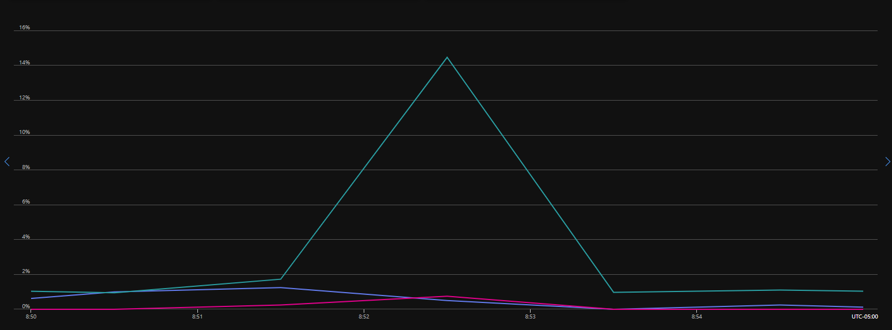

# Diagnosing Burst-Induced SQL Server Disk Latency Without Increasing Infrastructure Cost

## Overview

This case study documents the investigation and mitigation of recurring SQL Server disk latency alerts on an Azure-hosted SQL Server virtual machine.

The issue presented as intermittent **critical write-latency alerts** against SQL Server ROWS data files. Initial suspicion included Query Store, log backups, autogrowth, and scheduled maintenance activity. Through targeted short-interval capture and correlation with Azure storage metrics, the issue was narrowed to **burst-driven data-file write latency caused by checkpoint / dirty-page flush behavior under legacy application workload patterns**.

The final operational outcome was not a full infrastructure redesign or application rewrite. Instead, the issue was:

- Identified
- Measured
- Partially mitigated
- Tuned in monitoring to reduce alert noise
- Documented as a known operational behavior

This approach avoided unnecessary storage spend while preserving meaningful alerting for true regressions.

---

## Environment

- SQL Server on Azure Virtual Machine
- Azure VM size: **Standard E32s v5**
  - 32 vCPU
  - 256 GB RAM
- Azure Premium SSD-managed disks
- SQL Server data and log files placed on separate drives
- SQL Server Agent used for backup and monitoring activity
- Custom disk-latency monitoring based on interval snapshots
- Legacy application workload with limited development-side flexibility

---

## Problem

Recurring disk latency alerts were firing against SQL Server data files.

The alerts appeared as short-duration critical write-latency events on ROWS files, with examples such as:

| Time Window | File | File Type | Writes | Avg Write Latency |
|---|---|---:|---:|---:|
| 2026-04-21 09:20–09:25 | DatabaseA | ROWS | 10,574 | 384.71 ms |
| 2026-04-21 14:20–14:25 | DatabaseB | ROWS | 10,393 | 368.25 ms |

The default alert thresholds were:

| Severity | Read Latency | Write Latency |
|---|---:|---:|
| Warning | > 140 ms | > 140 ms |
| Critical | > 300 ms | > 300 ms |

Additional alert rules included:

- Minimum activity threshold
  - Reads >= 1,000
  - Writes >= 8,000
- Warning required repeated occurrences
- Critical events alerted immediately
- Alert cooldown of 30 minutes

The alerts created operational noise and risked sending future troubleshooting efforts down the wrong path.

---

## Initial Hypotheses

Several possible causes were considered.

### Query Store

Query Store was initially considered because it writes data into the user database and can generate additional background I/O.

However, Query Store settings were reasonable:

| Setting | Value |
|---|---|
| Actual State | READ_WRITE |
| Desired State | READ_WRITE |
| Capture Mode | AUTO |
| Flush Interval | 900 seconds |
| Max Storage | 2048 MB |
| Current Storage | ~1172 MB |
| Wait Stats Capture | ON |
| Size-Based Cleanup | AUTO |

Query Store was not near capacity and was not configured aggressively.

### Log Backups

The latency events appeared to correlate with transaction log backup windows.

However, the alerts were firing on **ROWS data files**, not LOG files. Because data and log files were on separate drives, log backups were unlikely to be the direct cause of ROWS write latency.

### Full / Differential Backups

Full and differential backups were reviewed and ruled out because they were not occurring during the alert windows.

### Statistics, Index Maintenance, and CHECKDB

Maintenance activity was also ruled out because statistics maintenance, index maintenance, and CHECKDB were scheduled after hours.

### Data File Autogrowth

The offending database had limited free space in the data file:

| File Type | Current Size | Used Space | Free Space | Autogrowth |
|---|---:|---:|---:|---:|
| LOG | ~153 GB | ~259 MB | ~153 GB | 4096 MB |
| ROWS | ~101 GB | ~99 GB | ~2 GB | 512 MB |

The ROWS file was proactively grown and autogrowth was adjusted to reduce the chance of growth pressure during peak write windows.

This was a valid improvement, but the latency issue later recurred, indicating autogrowth was not the primary cause.

---

## Investigation Approach

Because manual checks after the fact were not sufficient, a temporary lightweight capture process was created.

The goal was to collect enough data during the suspected time window without building a permanent monitoring subsystem.

### Capture Design

A temporary capture was implemented using:

- One table in `msdb`
- One stored procedure
- One SQL Server Agent job
- Short capture window
- 15-second interval collection

The capture collected:

- File I/O counters from `sys.dm_io_virtual_file_stats`
- Active requests from `sys.dm_exec_requests`
- Waiting tasks from `sys.dm_os_waiting_tasks`

The collection window was widened after review of alert timing:

- Initial target: 7:45 AM – 8:35 AM
- Updated target: 7:30 AM – 9:30 AM

The interval was eventually reduced from one minute to 15 seconds because earlier captures showed very few rows and the issue appeared to be short-lived.

---

## Capture Table

```sql
USE [msdb];
GO

IF OBJECT_ID('dbo.MorningIoCapture', 'U') IS NULL
BEGIN
    CREATE TABLE dbo.MorningIoCapture
    (
        capture_time          datetime2(0) NOT NULL,
        capture_type          varchar(20) NOT NULL,   -- FILE_IO / REQUEST / WAIT
        database_name         sysname NULL,
        file_logical_name     sysname NULL,
        file_type_desc        nvarchar(60) NULL,
        num_of_reads          bigint NULL,
        io_stall_read_ms      bigint NULL,
        num_of_writes         bigint NULL,
        io_stall_write_ms     bigint NULL,
        session_id            smallint NULL,
        status                nvarchar(60) NULL,
        command               nvarchar(60) NULL,
        wait_type             nvarchar(120) NULL,
        wait_time_ms          bigint NULL,
        blocking_session_id   smallint NULL,
        reads                 bigint NULL,
        writes                bigint NULL,
        logical_reads         bigint NULL,
        sql_text              nvarchar(4000) NULL
    );

    CREATE INDEX IX_MorningIoCapture_Time
        ON dbo.MorningIoCapture (capture_time, capture_type);
END
GO
```

---

## Capture Procedure

```sql
USE [msdb];
GO

CREATE OR ALTER PROCEDURE dbo.CaptureMorningIo
AS
BEGIN
    SET NOCOUNT ON;

    DECLARE @CaptureTime datetime2(0) = SYSDATETIME();

    INSERT INTO dbo.MorningIoCapture
    (
        capture_time,
        capture_type,
        database_name,
        file_logical_name,
        file_type_desc,
        num_of_reads,
        io_stall_read_ms,
        num_of_writes,
        io_stall_write_ms
    )
    SELECT
        @CaptureTime,
        'FILE_IO',
        DB_NAME(vfs.database_id),
        mf.name,
        mf.type_desc,
        vfs.num_of_reads,
        vfs.io_stall_read_ms,
        vfs.num_of_writes,
        vfs.io_stall_write_ms
    FROM sys.dm_io_virtual_file_stats(NULL, NULL) AS vfs
    JOIN sys.master_files AS mf
        ON vfs.database_id = mf.database_id
       AND vfs.file_id = mf.file_id
    WHERE DB_NAME(vfs.database_id) IN (N'DatabaseA', N'DatabaseB');

    INSERT INTO dbo.MorningIoCapture
    (
        capture_time,
        capture_type,
        database_name,
        session_id,
        status,
        command,
        wait_type,
        wait_time_ms,
        blocking_session_id,
        reads,
        writes,
        logical_reads,
        sql_text
    )
    SELECT
        @CaptureTime,
        'REQUEST',
        DB_NAME(r.database_id),
        r.session_id,
        r.status,
        r.command,
        r.wait_type,
        r.wait_time,
        r.blocking_session_id,
        r.reads,
        r.writes,
        r.logical_reads,
        LEFT(st.text, 4000)
    FROM sys.dm_exec_requests AS r
    OUTER APPLY sys.dm_exec_sql_text(r.sql_handle) AS st
    WHERE DB_NAME(r.database_id) IN (N'DatabaseA', N'DatabaseB');

    INSERT INTO dbo.MorningIoCapture
    (
        capture_time,
        capture_type,
        database_name,
        session_id,
        wait_type,
        wait_time_ms,
        blocking_session_id,
        sql_text
    )
    SELECT
        @CaptureTime,
        'WAIT',
        DB_NAME(r.database_id),
        wt.session_id,
        wt.wait_type,
        wt.wait_duration_ms,
        wt.blocking_session_id,
        LEFT(st.text, 4000)
    FROM sys.dm_os_waiting_tasks AS wt
    LEFT JOIN sys.dm_exec_requests AS r
        ON wt.session_id = r.session_id
    OUTER APPLY sys.dm_exec_sql_text(r.sql_handle) AS st
    WHERE DB_NAME(r.database_id) IN (N'DatabaseA', N'DatabaseB');
END
GO
```

---

## SQL Agent Capture Job

```sql
USE msdb;
GO

DECLARE @jobId UNIQUEIDENTIFIER;

EXEC sp_add_job
    @job_name = N'Morning IO Capture',
    @enabled = 1,
    @description = N'Temporary capture of IO, requests, and waits during morning latency window',
    @start_step_id = 1,
    @owner_login_name = 'sa',
    @job_id = @jobId OUTPUT;

EXEC sp_add_jobstep
    @job_id = @jobId,
    @step_name = N'Capture Snapshot',
    @subsystem = N'TSQL',
    @command = N'EXEC msdb.dbo.CaptureMorningIo;',
    @database_name = N'msdb',
    @on_success_action = 1,
    @on_fail_action = 2;

EXEC sp_add_schedule
    @schedule_name = N'Morning IO Capture Schedule',
    @enabled = 1,
    @freq_type = 4,
    @freq_interval = 1,
    @freq_subday_type = 4,
    @freq_subday_interval = 15,
    @active_start_time = 73000,
    @active_end_time = 93000;

EXEC sp_attach_schedule
    @job_id = @jobId,
    @schedule_name = N'Morning IO Capture Schedule';

EXEC sp_add_jobserver
    @job_id = @jobId,
    @server_name = N'(LOCAL)';
GO
```

---

## Delta Analysis Query

The raw I/O values from `sys.dm_io_virtual_file_stats` are cumulative, so delta analysis was required.

```sql
WITH x AS
(
    SELECT
        capture_time,
        database_name,
        file_logical_name,
        file_type_desc,
        num_of_writes,
        io_stall_write_ms,
        LAG(num_of_writes) OVER
        (
            PARTITION BY database_name, file_logical_name
            ORDER BY capture_time
        ) AS prev_writes,
        LAG(io_stall_write_ms) OVER
        (
            PARTITION BY database_name, file_logical_name
            ORDER BY capture_time
        ) AS prev_stall
    FROM msdb.dbo.MorningIoCapture
    WHERE capture_type = 'FILE_IO'
)
SELECT
    capture_time,
    database_name,
    file_logical_name,
    file_type_desc,
    num_of_writes - prev_writes AS writes_in_interval,
    io_stall_write_ms - prev_stall AS stall_ms_in_interval,
    CASE
        WHEN (num_of_writes - prev_writes) = 0 THEN 0
        ELSE (io_stall_write_ms - prev_stall) * 1.0
             / NULLIF(num_of_writes - prev_writes, 0)
    END AS avg_write_latency_ms
FROM x
WHERE prev_writes IS NOT NULL
ORDER BY avg_write_latency_ms DESC;
```

---

## Key Findings

The 15-second capture exposed write bursts that were not obvious in one-minute snapshots or regular monitoring views.

### Before Tuning

| Capture Time | File | File Type | Writes in Interval | Stall ms in Interval | Avg Write Latency |
|---|---|---:|---:|---:|---:|
| 2026-04-24 07:51:16 | DatabaseA | ROWS | 11,692 | 4,982,983 | 426.19 ms |
| 2026-04-24 08:21:16 | DatabaseB | ROWS | 14,030 | 7,575,865 | 539.98 ms |

These rows aligned closely with the disk latency alerts.

The pattern was significant:

- High ROWS writes
- Very high write latency
- Low read activity
- No obvious active query driving the spike
- No corresponding maintenance activity

This indicated the alerts were not caused by a single foreground query. Instead, they were consistent with dirty pages accumulating in memory and later being flushed to disk in bursts.

---

## Azure Metrics Review

Azure VM and disk metrics were reviewed during the alert window.

The Azure graphs did not show sustained IOPS or throughput saturation. Utilization remained low overall, with only brief spikes.



This was an important distinction:

> SQL Server observed high write latency during short flush windows, while Azure metrics showed low averaged utilization.

This suggested the issue was not a simple “disk tier is too small” problem.

Instead, it pointed toward:

- Short-duration burst behavior
- Queueing during microbursts
- Storage path sensitivity to sudden write flushes
- SQL Server seeing the pain before platform-level averaged metrics made it obvious

---

## Root Cause

The issue was determined to be:

> **Burst-induced SQL Server ROWS write latency caused by checkpoint / dirty-page flush behavior under legacy application workload patterns.**

The system was not constrained under steady-state average load.

The issue occurred when SQL Server attempted to flush a large number of dirty pages to disk in a short interval. The storage path could handle normal workload levels, but short write bursts produced high latency and triggered critical monitoring alerts.

---

## Mitigation

Because application-side workload changes were not practical, the mitigation focused on reducing burst intensity and tuning monitoring to reflect known behavior.

### 1. Proactive Data File Sizing

The data file was proactively grown and autogrowth settings were adjusted to reduce the chance of autogrowth occurring during busy windows.

This removed one possible amplifier, but the issue still recurred, confirming autogrowth was not the primary cause.

### 2. Recovery Interval Tuning

The SQL Server `recovery interval (min)` setting was changed from the default automatic behavior to 5 minutes.

Current setting check:

```sql
SELECT
    name,
    value AS config_value,
    value_in_use AS run_value
FROM sys.configurations
WHERE name = 'recovery interval (min)';
```

Change applied:

```sql
EXEC sp_configure 'show advanced options', 1;
RECONFIGURE;

EXEC sp_configure 'recovery interval (min)', 5;
RECONFIGURE;
```

This setting is server-wide and does not require a restart.

The intent was to encourage more gradual checkpoint behavior and reduce the size of burst flushes.

### 3. Targeted Alert Tuning

After mitigation, alerts still occurred, but at lower severity levels than before.

Because the issue was understood and did not have observed production impact, monitoring thresholds were adjusted only for the affected databases.

The global latency thresholds were not changed.

For the two known problematic databases, the critical write-latency threshold was raised to:

```text
Critical Write Latency: 400 ms
```

This avoided masking real issues elsewhere while reducing noise for a known, measured behavior.

---

## Results

### Before Recovery Interval Tuning

| Capture Time | Writes | Avg Write Latency |
|---|---:|---:|
| 2026-04-24 07:51:16 | 11,692 | 426.19 ms |
| 2026-04-24 08:21:16 | 14,030 | 539.98 ms |

### After Recovery Interval Tuning

| Capture Time | Writes | Avg Write Latency |
|---|---:|---:|
| 2026-04-27 08:51:16 | 9,374 | 325.31 ms |

### Observed Improvement

The change did not eliminate the behavior, but it reduced the severity:

- Burst size decreased
- Average write latency decreased
- Alert behavior became more predictable
- Remaining alerts were treated as known operational noise rather than an unknown incident

Approximate improvement:

| Comparison | Latency Reduction |
|---|---:|
| 426.19 ms → 325.31 ms | ~23.7% reduction |
| 539.98 ms → 325.31 ms | ~39.8% reduction |

---

## Operational Decision

Further remediation options were considered:

### Storage Upgrade

A storage upgrade or disk striping could potentially improve burst handling.

However:

- Azure metrics did not show sustained utilization pressure
- No user-facing impact was observed
- Budget was limited
- The remaining issue was intermittent and understood

A storage upgrade was not justified.

### Application Workload Fix

The legacy application likely contributed to the bursty write pattern.

However:

- The application was old
- Development-side changes were unlikely
- Proving the behavior did not guarantee remediation
- The business impact did not justify escalation into a development redesign effort

Application remediation was not pursued.

### Monitoring Adjustment

Targeted monitoring adjustment was selected as the appropriate final operational action.

This preserved strict global monitoring while preventing known, low-impact behavior from generating unnecessary critical investigations.

---

## Final Outcome

The issue was operationally resolved as a managed condition.

Final state:

- Root cause identified
- Query Store ruled out
- Maintenance jobs ruled out
- Log backups ruled out as direct cause
- Autogrowth corrected as a preventive improvement
- Checkpoint / flush behavior confirmed as major contributor
- Recovery interval tuning reduced severity
- Critical thresholds adjusted only for affected databases
- Global monitoring sensitivity preserved
- No unnecessary infrastructure cost introduced
- No low-value development escalation pursued

---

## Key Takeaways

### 1. High Latency Does Not Always Mean Capacity Exhaustion

Azure metrics showed low averaged utilization, while SQL Server captured severe short-interval write latency.

This demonstrated the difference between:

- Sustained resource saturation
- Short-duration microburst behavior

### 2. Raw DMV Values Are Not Enough

`sys.dm_io_virtual_file_stats` is cumulative.

The useful signal came from short-interval deltas.

### 3. Sampling Resolution Matters

One-minute capture was too coarse.

Fifteen-second sampling exposed the actual write burst pattern.

### 4. Fixes Should Match Business Impact

The technical fix was not to spend more money or demand application changes.

The correct operational response was:

- mitigate what could be mitigated safely
- tune monitoring for known behavior
- preserve alerts for true abnormal conditions

### 5. Good Operations Includes Knowing When Not to Escalate

Not every technical imperfection justifies a major project.

In this case, the best result was a measured, documented, and cost-aware operational decision.

---

## Summary

This investigation transformed a recurring disk latency alert from an unclear production concern into a known and managed operational behavior.

The final solution combined:

- targeted SQL capture
- short-interval delta analysis
- Azure metric correlation
- SQL Server checkpoint tuning
- database-specific alert threshold adjustment

The result was reduced latency severity, reduced alert noise, and a defensible operational decision that avoided unnecessary infrastructure cost or low-value escalation.
