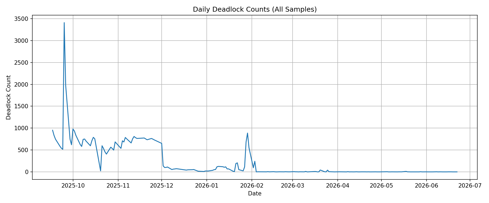

# Reducing 2,000+ Daily SQL Server Deadlocks to Near Zero

## Overview
This case study outlines the investigation, remediation, and operationalization of a high-volume deadlock issue affecting multiple SQL Server instances. The work resulted in a near-elimination of deadlocks and significantly improved system stability.

---

## Environment
- 3 SQL Server instances (Standard Edition)
- Production OLTP workloads
- Replication-based architecture (no Availability Groups)
- High concurrency across multiple application workloads

---

## Problem

The environment was experiencing **extreme deadlock frequency**, averaging:

- ~2,000 deadlocks per day across 3 servers

### Symptoms
- Application errors:
  - *"Transaction (Process ID ...) was deadlocked on lock resources..."*
- SQL Agent job failures and retries
- Unpredictable query performance
- Increased incident volume and operational noise

---

## Impact

- Production instability affecting multiple applications
- Frequent job failures and retries
- Reduced confidence in database reliability
- Increased reactive support workload

---

## Investigation

### Key Challenge
SQL Server does not provide a simple, built-in way to track deadlocks over time.

### Approach
- Leveraged **Extended Events (`system_health`)**
- Built custom queries to extract and aggregate deadlock data:
  - Timestamp
  - Database
  - Frequency

### Findings
Deadlocks were **not random** — clear patterns emerged:
- Specific databases and workloads repeatedly involved
- High contention during maintenance windows
- Conflicting query access patterns

---

## Root Causes

1. **Inefficient indexing strategy**
   - Missing and overlapping indexes
   - Non-optimal access paths

2. **Statistics maintenance issues**
   - Overly broad updates
   - Poor timing relative to workload

3. **Conflicting query patterns**
   - Competing read/write operations
   - Lack of consistent access order

4. **Schema inconsistency**
   - Key column mismatch (`VARCHAR` vs `NVARCHAR`)

---

## Solution

### 1. Index Optimization
- Rebuilt and consolidated indexes
- Eliminated redundant structures
- Improved access path consistency

### 2. Statistics Strategy Redesign
- Moved from blanket updates → targeted approach
- Introduced phased maintenance:
  - Daily sampled updates
  - Monthly FULLSCAN for critical tables

### 3. Query & Schema Fixes
- Standardized data types
- Reduced implicit conversions
- Improved execution plan stability

### 4. Monitoring & Visibility
- Built deadlock tracking queries across all servers
- Established trend analysis for proactive detection

---

## Operationalization

To ensure long-term stability and repeatability, the solution was formalized into an operational system:

- Continuous deadlock monitoring
- Alerting pipeline for visibility
- Standardized investigation workflows

### Supporting Runbook
SQL Server Agent Alert Response Guide  
→ *(Link to your runbook here)*

---

## Results

- Deadlocks reduced from **~2,000/day → near zero**
- Sustained periods with **0 deadlocks**
- Significant reduction in:
  - Application errors
  - Job failures
  - Operational noise

### Measurable Outcomes
- Improved system stability
- Faster incident response
- Reduced reactive workload for support teams

### Resulting Metrics

---

## Key Takeaways

- Deadlocks at scale are rarely random — they are systemic
- Visibility (trend analysis) is critical before remediation
- Indexing and statistics strategy must align with workload patterns
- Small schema inconsistencies can have large systemic impact
- The real value comes from **systemizing the fix**, not just resolving the issue

---

## Next Steps / Enhancements

- Expand monitoring to include blocking trends
- Integrate alert thresholds for early detection
- Extend reporting across additional environments
- Continue refining maintenance strategies based on workload evolution

---

## Summary

This effort transformed a highly unstable SQL Server environment into a predictable and reliable system by:

- Identifying systemic contention issues
- Implementing targeted, data-driven fixes
- Converting reactive troubleshooting into proactive operations

The result is a **repeatable operational model** for managing concurrency and maintaining database stability at scale.
